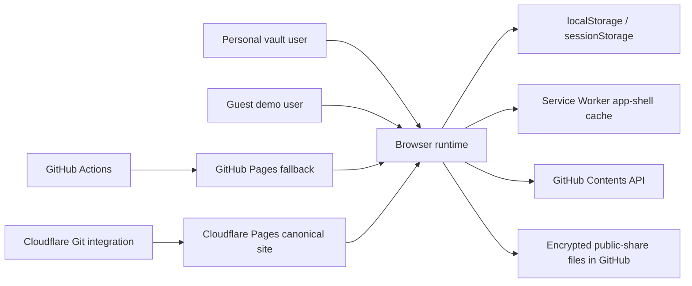
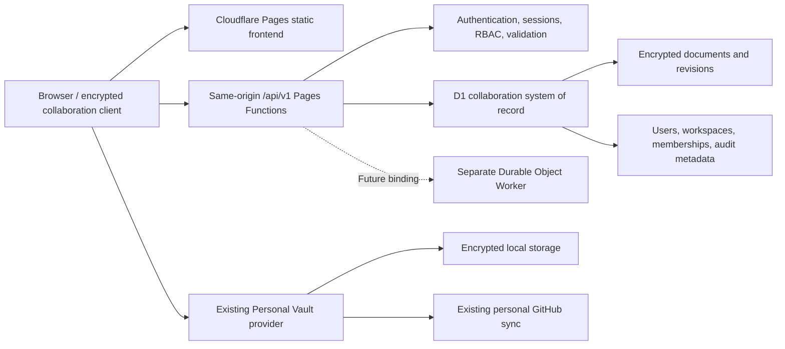

# Collaboration Foundation Architecture Discovery

Status: Day 1 draft

Owner: Senior Developer / Architect

Reviewers: BA/PO, Security, Senior QA

Last reviewed: 2026-07-15

## 1. Purpose

This document records the verified current architecture, its collaboration constraints, the proposed target boundary, and the expected disposition of existing components. It is an inventory and discovery artifact. Detailed architecture choices remain provisional until their Phase 0 ADRs are approved.

## 2. Evidence inspected

The inventory was derived from the runtime and quality-gate sources below:

- `index.html` and its ordered classic-script runtime.
- `js/bootstrap.js`, `js/events.js`, `js/state.js`, and document action modules.
- `storage.js`, including Vault V1/V2, LocalAuth, GitHubSync, and DocStorage.
- `js/actions-sharing.js` and the public-share registry.
- `sw.js` and its offline application-shell strategy.
- `_headers` and the current CSP/security-header policy.
- `scripts/build-pages.mjs` and the runtime-asset allow-list build.
- `.github/workflows/deploy.yml` and the GitHub Pages fallback deployment.
- `tests/`, `tests/run.mjs`, and `scripts/quality-check.mjs`.

## 3. Current system context

DocVault is an offline-first, single-user browser application. It has no application backend and no stable user identity. A vault password unlocks one local vault; it does not identify an individual team member.

### 3.1 Browser runtime

- The application is composed of classic JavaScript files loaded in a strict order from `index.html`.
- Application state is global: `state` and `documents` are mutable in-memory values.
- UI rendering, actions, search, and category-specific editors/viewers operate directly on the global document array.
- `persist()` delegates the complete document collection to `DocStorage.save()`.
- Guest mode uses isolated in-memory fixtures and intentionally bypasses LocalAuth, local persistence, and GitHub sync.

### 3.2 Local persistence and encryption

- `DocStorage` stores the personal vault under `docvault_docs` in `localStorage` or compatible extension storage.
- When a vault password is active, the complete local collection is encrypted using the self-describing Vault V2 envelope.
- Vault V2 uses PBKDF2-SHA256, AES-256-GCM, a per-vault salt, an authenticated header, and a fresh IV.
- Credential passwords receive additional field-level encryption before the collection envelope is written.
- The active vault password is held in `sessionStorage` for the browser session.
- Recovery metadata and password hints are local browser records and may be synchronized as security metadata by the personal GitHub flow.

### 3.3 Personal GitHub synchronization

- GitHub sync uses a locally configured Personal Access Token and the GitHub Contents API.
- The current repository defaults are embedded in the client.
- Documents are divided into 16 stable shards, with a separate metadata file.
- Writes are serialized and coalesced in memory; one durable pending marker records retry intent.
- Cross-device conflicts use document-level last-write-wins based on the greatest `updatedAt` or `focusWorkflowUpdatedAt` value.
- Deleted identifiers are maintained as tombstones.
- This model assumes one trusted vault owner. It has no membership, actor identity, server authorization, atomic revision check, or team audit boundary.

### 3.4 Public sharing

- Public sharing is read-only and separate from sync.
- A random AES-GCM key encrypts a share payload before upload to GitHub.
- The decryption key is placed in the URL fragment and is not sent to GitHub.
- The local share registry is browser-local.
- Credential documents are excluded from public sharing.
- A share link is a possession capability; it is not workspace membership or collaboration identity.

### 3.5 Offline behavior

- The Service Worker precaches an explicit application shell.
- Same-origin GET requests are network-first and fall back to cache.
- Cross-origin requests and non-GET requests are not intercepted.
- A future same-origin `/api/*` route is not yet excluded from caching. Phase 1 must make private API and authentication responses network-only and `no-store` before the first endpoint is enabled.

### 3.6 Deployment

- Cloudflare Pages is the canonical production deployment and is connected to `main`.
- GitHub Pages is deployed independently by GitHub Actions and remains available as a static fallback.
- `scripts/build-pages.mjs` publishes only the runtime dependency graph to `_site`.
- The current deployment artifact contains no Pages Functions, D1 bindings, Worker configuration, or database migrations.
- The current security headers are defined in `_headers` and apply on Cloudflare Pages. GitHub Pages cannot be assumed to serve equivalent custom headers.

## 4. Current document and mutation model

Documents are mutable JSON objects identified by a client-generated `id`. Common fields include `title`, `category`, `subfolder`, `status`, `content`, `tags`, category-specific data, `favorite`, `createdAt`, and `updatedAt`.

Important constraints:

- There is no `workspaceId`, `actorId`, `revision`, `baseRevision`, `keyVersion`, or `clientMutationId`.
- Timestamps are generated by each browser with `Date.now()`.
- Mutations replace objects in the global array and persist the collection afterward.
- Conflict resolution cannot distinguish concurrent edits from clock skew.
- Activity history is useful product history but is not a tamper-resistant, server-authoritative audit trail.
- Local exports may contain decrypted credential values and therefore remain a sensitive personal-vault operation.

## 5. Target collaboration boundary

The target keeps the static Pages frontend and adds a same-origin server boundary. Pages Functions are Workers executed on requests, and D1 provides the proposed relational collaboration record. Durable Objects are deferred until realtime coordination is justified; a Durable Object must be deployed separately and bound to Pages rather than being defined inside a Pages project.

References:

- [Cloudflare Pages Functions bindings](https://developers.cloudflare.com/pages/functions/bindings/)
- [Cloudflare Durable Objects overview](https://developers.cloudflare.com/durable-objects/concepts/what-are-durable-objects/)

### Target invariants

- `/api/v1` is the only collaboration server boundary.
- Authentication establishes a stable user identity; the personal master password does not.
- Authorization is enforced server-side for every workspace resource.
- The collaboration database never needs document plaintext, workspace private keys, device private keys, or personal GitHub PATs.
- The browser encrypts collaboration content before upload.
- Server revision numbers and timestamps are authoritative for shared data.
- Personal and collaboration providers remain isolated.
- Importing a personal document into a workspace is explicit, reviewable, and excludes credentials.
- GitHub Pages detects the missing collaboration capability and fails closed into personal/guest mode.

## 6. Existing component disposition

| Component | Decision | Reason / required change |
|---|---|---|
| Static Pages UI and runtime asset build | Retain | Proven deployment; collaboration modules should be lazy-loaded and feature-flagged. |
| Global `state` and `documents` model | Adapt | Add explicit active mode/workspace and provider boundaries; avoid mixing personal and shared records. |
| Vault V2 primitives | Reuse selectively | Existing AES-GCM envelope provides useful compatibility, but workspace/device key envelopes require a separately versioned design. |
| LocalAuth master password | Retain for personal mode; adapt for device-key protection | It cannot act as team identity or a shared workspace password. |
| `DocStorage` | Split behind an interface | Preserve personal behavior; add a separate collaboration provider and IndexedDB outbox. |
| GitHubSync | Retain for personal mode only | PAT and timestamp merge are not a team authorization or concurrency model. |
| Timestamp last-write-wins | Replace for shared data | Use server revisions, `baseRevision`, atomic compare-and-set, and HTTP 409. |
| Public sharing | Retain as a separate capability | Do not treat share possession as membership; keep credentials excluded. |
| ActivityLog | Retain for personal UX | Add server-authoritative audit events for workspace security and accountability. |
| Service Worker app-shell cache | Adapt | `/api/*`, sessions, and private responses must be network-only and not cached. |
| GitHub Pages | Retain as fallback | Personal/guest only; collaboration must be disabled or unavailable. |
| Cloudflare Pages | Retain as canonical | Add Pages Functions and environment bindings in later phases. |
| D1 | Introduce in Phase 1/2 | Store identity, membership, sessions, invitations, encrypted revisions, and audit metadata. |
| Durable Objects | Defer | Only required when realtime coordination/presence becomes an approved scope item. |
| R2 | Defer | Attachments are outside Foundation scope. |

## 7. Primary gaps to close

### Identity and authorization

- No stable application user or device identity.
- No session backend, workspace membership, invitation lifecycle, or role policy.
- No server-side protection against IDOR or privilege escalation.

### Encryption and recovery

- One personal vault password cannot safely distribute workspace access.
- No per-device public keys, workspace key envelopes, key versions, rotation, or device revocation.
- No documented team recovery policy.

### Concurrency and offline sync

- Client clock and last-write-wins permit silent lost updates.
- The pending marker does not represent a durable, ordered, idempotent multi-user outbox.
- No authoritative server audit event connects a mutation to an actor.

### Deployment and operations

- No local/preview/production collaboration environment separation.
- No D1 migrations, backup/restore runbook, API observability, or feature flag.
- Cloudflare automatic Pages deployment and future schema migration ordering require an explicit rollout contract.

## 8. Regression surfaces

The following existing behavior must remain protected throughout implementation:

- Guest isolation and no-persistence guarantee.
- Personal vault unlock, password change, recovery, and V1-to-V2 migration.
- Credential field encryption and masking.
- Local save, import/export, soft delete, and tombstones.
- GitHub sharded pull/push, merge, queued writes, and reconnect retry.
- Read-only encrypted public sharing and revocation.
- Search, editor/viewer, category calculations, Focus Queue, Traceability, trends, and release quality scorecard.
- Service Worker offline app shell.
- CSP/security headers and runtime asset allow-list.
- GitHub Pages fallback and Cloudflare Pages canonical deployment.

## 9. Day 1 architecture decisions and open items

### Baseline assumptions accepted for discovery

- Cloudflare Pages remains canonical.
- Same-origin Pages Functions and D1 are the preferred Foundation boundary.
- Realtime collaboration is not part of Foundation.
- Personal Vault and collaboration remain separate providers.
- Shared credential documents are outside Foundation.
- No automatic personal-to-workspace migration occurs.

### Decisions deferred to later Phase 0 work

- OAuth provider and identity-linking edge cases.
- Session duration, renewal, revocation, and CSRF mechanism.
- Exact encrypted metadata boundary.
- Device-key algorithm and private-key protection mechanism.
- Recovery-kit and lost-device product behavior.
- Invitation targeting and identity binding.
- D1 entity retention periods and audit retention.
- API pagination and payload limits.
- Preview OAuth callback and binding strategy.
- Migration orchestration relative to Cloudflare automatic deployments.

## 10. Gate G0 — Architecture discovery checklist

- [x] Current browser runtime and persistence paths inventoried.
- [x] Current authentication, sync, sharing, offline, and deployment paths inventoried.
- [x] Current and target system boundaries documented.
- [x] Existing components classified as retain, adapt, replace, introduce, or defer.
- [x] Personal Vault and collaboration isolation recorded as a target invariant.
- [x] GitHub Pages fallback behavior recorded as personal/guest only.
- [x] Primary affected modules and regression surfaces identified.
- [ ] BA/PO confirms product scope and non-goals.
- [x] Security confirms asset classification and trust-boundary inventory.
- [x] Senior QA confirms the regression surface is complete and testable.
- [x] Cross-functional Day 1 review records Gate G0 as conditionally ready with Product Owner confirmation pending.
