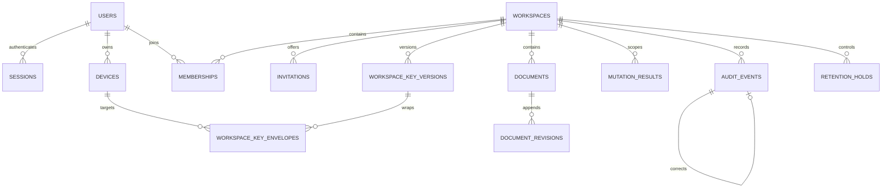

# CF-P2-001 schema inventory freeze

Status: PASS; Gate P2-G1 approved on 2026-07-16

Date: 2026-07-16

Story: `CF-P2-001`

Owners: Technical Lead and Senior QA

Reviewers: Product Owner, Security Reviewer, Operations

Machine-readable source: [`../../config/cloudflare/phase-2-schema-freeze.json`](../../config/cloudflare/phase-2-schema-freeze.json)

## 1. Decision and boundary

The inventory below is the canonical naming and ownership boundary for Phase 2 SQL, D1 row types, repositories, validation, fixtures, and evidence. It reconciles `schema-contract.md`, `api-contract.md`, `crypto-contract.md`, the RBAC/domain contract, data classification, ADR-002 through ADR-010, ADR-012, the threat model, and the traceability matrix.

This freeze closes previously descriptive names as follows:

- invitation terminal timestamps are exactly `accepted_at`, `revoked_at`, and `expired_at`;
- the workspace-envelope binary payload is `ciphertext`, and its canonical authenticated-data hash is `aad_digest`;
- revision payload storage is exactly `ciphertext_envelope`, `ciphertext_digest`, and `ciphertext_bytes`;
- audit correction links are `correction_of_event_id` and `related_event_id`;
- logical compatibility is recorded in singleton `schema_metadata` using `schema_version`, `minimum_runtime_schema`, `maximum_runtime_schema`, and `migration_set_digest`.

These names do not change API field casing or crypto envelope formats. Runtime adapters own the explicit camelCase/API-to-snake_case/storage mapping. No undeclared semantic metadata is permitted.

This story creates no migration SQL, D1 database, binding, user/workspace row, secret, or runtime persistence route. Production and preview remain unbound and collaboration remains disabled.

## 2. Canonical table inventory

The inventory contains one control table plus the 14 approved entity tables.

| Table | Migration | Scope | Repository owner | Primary contract purpose |
|---|---:|---|---|---|
| `schema_metadata` | 0001 | Database | Persistence Core | Logical schema and runtime compatibility |
| `users` | 0001 | Identity | Identity and Session | Immutable provider identity plus mutable display data |
| `oauth_transactions` | 0001 | Identity | Identity and Session | Short-lived OAuth state and encrypted PKCE verifier |
| `sessions` | 0001 | Identity | Identity and Session | Hashed session lifecycle and revocation |
| `workspaces` | 0002 | Workspace | Workspace | Workspace state and current key pointer |
| `memberships` | 0002 | Workspace | Workspace | Role, readiness, removal, and role version |
| `invitations` | 0002 | Workspace | Workspace | Immutable-subject, hashed-token invitation lifecycle |
| `devices` | 0003 | User | Key and Device | Canonical public device identity; never a private key |
| `workspace_key_versions` | 0003 | Workspace | Key and Device | Monotonic workspace key lifecycle |
| `workspace_key_envelopes` | 0003 | Workspace | Key and Device | Bound encrypted DEK envelopes only |
| `documents` | 0004 | Workspace | Document | Current encrypted revision pointer and tombstone state |
| `document_revisions` | 0004 | Workspace | Document | Append-only encrypted revision history |
| `mutation_results` | 0004 | Workspace | Persistence Core | Idempotency, request fingerprint, and atomic guard result |
| `audit_events` | 0005 | Workspace | Audit and Retention | Append-only security/domain history |
| `retention_holds` | 0005 | Workspace | Audit and Retention | Approved hold lifecycle without free-form content |

The exact ordered column arrays, requirements, owners, and invariant IDs are machine checked from the JSON source. SQL types, checks, foreign keys, and indexes are implemented only in `CF-P2-002` after Gate P2-G1.

## 3. Relationship map

Every workspace-scoped repository query must bind an authenticated `workspace_id` predicate even when a globally unique opaque ID is also present. Authorization by an opaque ID alone is prohibited.

## 4. Critical and High invariant evidence map

| Invariant family | Constraint or immutable structure | Guarded recipe | Required negative/fault test | Closing evidence |
|---|---|---|---|---|
| `INV-ID`, `INV-AUTH`, `INV-SES` | Unique provider subject and digests; bounded expiry/state checks | One-time OAuth consume; live session/revocation check | Subject collision, replay, expiry, raw-token canary, failed consume | `CF-EV-P2-STA-002`, `CF-EV-P2-INT-001`, `CF-EV-P2-SEC-002` |
| `INV-WS`, `INV-RBAC` | Workspace FK scope; membership composite key; role/state checks | Workspace create; role/member change; last-Owner guard | Cross-workspace ID, forged role/version, zero-row update, last-Owner race | `CF-EV-P2-INT-002`, `CF-EV-P2-SEC-003` |
| `INV-INV` | One pending invitation per immutable target; unique token digest | Replace/create and accept batches | Replay, wrong subject, expiry/revoke/accept race, partial membership | `CF-EV-P2-INT-004`, `CF-EV-P2-INT-005`, `CF-EV-P2-SEC-005` |
| `INV-DEV`, `INV-KEY`, `INV-ENV` | Device fingerprint uniqueness; monotonic key version; one current version; unique target envelope | Provision envelope; prepare/commit rotation | Key substitution, stale/revoked device, gap/reuse, incomplete rotation | `CF-EV-P2-INT-003`, `CF-EV-P2-SEC-004` |
| `INV-DOC`, `INV-REV` | Workspace/document identity; current pointer; append-only revision key | Document CAS mutation | Stale base, cross-workspace ID, duplicate revision, failure at each statement | `CF-EV-P2-INT-004`, `CF-EV-P2-INT-005`, `CF-EV-P2-SEC-005` |
| `INV-MUT` | Scoped unique mutation key and 32-byte fingerprint | Guard row is the first statement of every domain batch | Same/different fingerprint races, response loss, zero-row security write | `CF-EV-P2-UT-001`, `CF-EV-P2-INT-003`, `CF-EV-P2-SEC-004` |
| `INV-AUD`, `INV-HOLD` | Monotonic append-only event identity and hold references | Exactly one audit event in each successful domain batch | Missing/duplicate/updated audit, correction misuse, failed hold transition | `CF-EV-P2-INT-006`, `CF-EV-P2-SEC-006` |
| `INV-RET` | Server-time expiry columns and hold-aware eligibility | Bounded idempotent purge per record type | Before/at/after boundary, rerun, cross-type isolation, held audit | `CF-EV-P2-INT-006`, `CF-EV-P2-SEC-006` |
| `INV-MIG` | Immutable sequence/checksum plus logical compatibility singleton | Controlled migration step outside runtime requests/builds | Gap, duplicate, checksum drift, unknown history, interruption, wrong environment | `CF-EV-P2-STA-001`, `CF-EV-P2-SEC-001`, then `CF-EV-P2-INT-001` |

No invariant is considered implemented by this map. The named later evidence must execute against disposable real local D1, and remote claims require their separately approved gate.

## 5. Data classification freeze

Allowed server-visible data is limited to opaque IDs, immutable provider subjects, bounded display fields, roles/states, server timestamps, sizes, versions, digests, canonical public JWKs, ciphertext/envelopes, and allow-listed bounded audit/result metadata.

The following are prohibited from every D1 column, fixture, migration, validation output, log, evidence file, and build artifact:

- plaintext document title, category, status, tags, body, custom fields, or search index;
- credentials, Personal Vault passwords/keys, PATs, provider tokens, OAuth codes, raw session/invitation tokens, or raw request bodies;
- unlock secrets, KEKs, private PKCS#8/JWK material, plaintext workspace DEKs, shared secrets, or wrapping keys;
- free-form audit reasons or metadata outside the versioned allow-list;
- client-authored role/authority, server time, revision result, or workspace ownership.

The official client must reject Credential documents before collaboration encryption. The API cannot inspect an authorized malicious client's opaque ciphertext; this remains the explicitly accepted E2EE residual limitation and is not reclassified as server enforcement.

## 6. Query and repository freeze

- Prepared statements with `.bind()` are mandatory.
- Explicit selected/inserted/updated columns are mandatory; `SELECT *` is forbidden.
- Workspace-scoped statements require `workspace_id` in the predicate or join path.
- Security transitions must fail by a constraint/guard when authority or state is stale; a successful zero-row write is never success.
- Writes must inspect D1 success/change metadata and the deterministic final result.
- Multi-statement domain changes use one D1 `batch()` recipe; runtime code does not hold an interactive transaction across requests.
- Read-after-write and authorization-sensitive reads use the approved primary-consistency session contract.
- Mutable collections use stable keyset pagination; offset pagination is prohibited.

## 7. Gate P2-G1 disposition

Story implementation and local static evidence: **PASS**.

Gate decision: **PASS on 2026-07-16**. Product approved `CF-P2-002` local migration implementation. This approval does not authorize a remote D1 resource, binding, migration, data, or collaboration activation.
