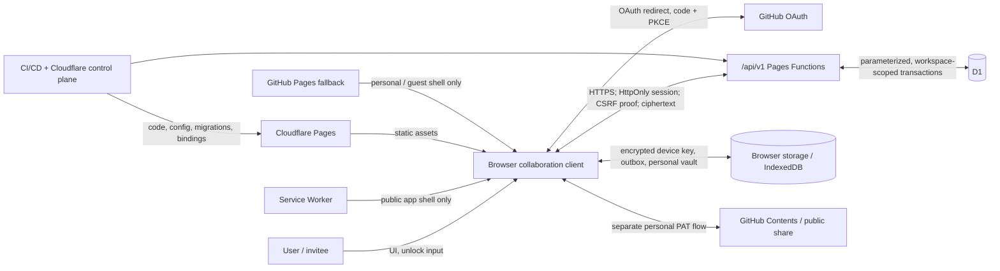

# Collaboration Foundation Threat Model

## Document control

| Field | Value |
| --- | --- |
| Document ID | CF-SEC-001 |
| Phase | Phase 0 - Specification and Threat Model |
| Checkpoint | Day 4 — Contract and risk clarification |
| Status | Gates G0, G1, and G2 approved; Day 4 update proposed for Gate G3; no runtime implementation authorized |
| Scope | Collaboration Foundation and its isolation from Personal Vault, guest mode, public sharing, and GitHub Sync |
| Owners | Security Reviewer and Technical Lead |
| Required reviewers | Product Owner, Senior QA, UX Lead |
| Inputs | `product-spec.md`, `architecture.md`, `data-classification.md`, `traceability-matrix.md` |
| Last updated | 2026-07-15 |

## 1. Method, scoring, and security objectives

This model applies STRIDE to assets, data flows, trust boundaries, and abuse cases. It models inherent risk before controls and residual risk after the required controls. It does not claim that a control exists until implementation evidence is linked.

Likelihood and impact use a 1-5 scale. Inherent score is `likelihood x impact`: Critical 20-25, High 12-19, Medium 6-11, Low 1-5. Severity maps release impact: P0 production-wide or broadly irreversible compromise; P1 confidentiality, integrity, authorization, cryptographic, or unrecoverable-data failure; P2 major failure with a practical workaround and no such loss; P3 limited impact. All P0/P1 threats block release while exploitable or unverified.

Security objectives:

1. A stable authenticated user and registered device are distinct from a Personal Vault password.
2. Every collaboration operation is authenticated, CSRF-protected where applicable, and authorized by server-side workspace scope and role.
3. The server, D1, logs, builds, and operators never receive document plaintext, plaintext workspace keys, device private keys, raw session tokens, personal passwords, PATs, or recovery secrets.
4. Key envelopes are bound to the intended workspace, user, device, algorithm, and key version; membership is not equivalent to key readiness.
5. Server revisions, idempotency keys, and atomic transactions prevent silent overwrite and duplicate business mutations.
6. Personal, guest, public-share, fallback, preview, and production contexts remain isolated and fail closed.

## 2. Assets and threat actors

Critical assets are OAuth secrets/codes/tokens, raw sessions, invitation tokens while valid, device private keys, workspace data-encryption keys, Personal Vault passwords and keys, GitHub PATs, and recovery secrets. Restricted assets include plaintext documents, ciphertext and revisions, key envelopes, session records, offline outboxes, and audit/security metadata. Internal assets include identities, roles, memberships, device public keys, opaque IDs, revisions, and deployment configuration.

Actors considered are legitimate Owner/Admin/Editor/Viewer users, invitees, removed members, revoked or pending-key devices, guests, external attackers, malicious or compromised authorized members, compromised browsers/extensions, OAuth or infrastructure adversaries, operators, and supply-chain/CI attackers. E2EE does not protect plaintext on a compromised authorized endpoint or prevent an authorized user copying content.

## 3. Data-flow diagram and trust boundaries

Trust boundaries:

| TB | Boundary | Untrusted input and required invariant |
| --- | --- | --- |
| TB1 | User/device to browser runtime | Rendered/decrypted content and local state are hostile until validated; clear secrets on lock/account change; XSS can defeat E2EE while unlocked. |
| TB2 | Browser to persistent storage | Origin storage is not a hardware boundary; private keys/outbox require encryption, binding, expiry/quarantine, and supported-browser checks. |
| TB3 | Service Worker/cache | `/api/*`, auth, invitation, and private responses are network-only and `no-store`; cached navigation HTML is never an API response. |
| TB4 | Browser to Pages Functions | TLS is necessary but insufficient; validate session, origin/CSRF, schema, size, identifiers, revision, device, and idempotency on every request. |
| TB5 | Pages Functions to D1 | D1 is trusted for metadata/ciphertext durability, not plaintext secrets; use atomic parameterized workspace-scoped queries. |
| TB6 | Browser/API to OAuth provider | Exact redirect URI, state, PKCE, single-use code, provider-subject identity, and response validation are mandatory. |
| TB7 | Collaboration to personal/share providers | Personal Vault, PAT sync, public sharing, and guest data never become collaboration identity, membership, storage, or implicit migration. |
| TB8 | Cloudflare canonical to GitHub Pages fallback | Fallback exposes no operational collaboration UI, session/key transfer, API loops, or local workspace imitation. |
| TB9 | Preview to production | Separate D1, OAuth apps, secrets, session namespaces, accepted origins, migrations, and telemetry. |
| TB10 | Source/CI/control plane to production | Least privilege, protected secrets, reviewed artifacts/migrations, dependency integrity, and auditable deployment changes. |

## 4. STRIDE threat register

`Residual` is the target after all listed controls and evidence pass; a target is not acceptance. Prevention (P), detection (D), and recovery (R) are all required unless explicitly deferred by an approved ADR.

| ID | STRIDE | Scenario / affected assets | L | I | Inherent | Severity | Required P / D / R | Target residual; owner | Trace |
| --- | --- | --- | ---: | ---: | --- | --- | --- | --- | --- |
| T01 | S | OAuth state/PKCE swap, callback replay, account linking by mutable login/email, or open redirect impersonates a user. | 4 | 5 | 20 Critical | P1 | P: exact redirect allow-list, high-entropy single-use state, PKCE, code expiry, immutable provider subject, generic errors. D: callback failure/rate metrics and privacy-safe audit. R: revoke sessions and identity links; incident review. | Medium; Security Reviewer | CF-ID-001-004, AB-01 |
| T02 | S/E | Stolen, fixed, raw-stored, logged, expired, or non-revoked session enables takeover or survives logout/security events. | 4 | 5 | 20 Critical | P1 | P: random cookie, Secure/HttpOnly/SameSite, hashed D1 token, rotation, absolute/idle expiry, re-auth for high-risk actions, immediate revocation. D: session anomaly and revocation tests. R: revoke user/device sessions and rotate signing secrets by runbook. | Medium; Security Reviewer / Technical Lead | CF-SES-001-002, CF-ID-003, AB-02 |
| T03 | T/E | Cross-site requests perform mutations using ambient session authority. | 4 | 5 | 20 Critical | P1 | P: SameSite plus approved CSRF token and strict Origin validation on every state-changing route; no GET mutation. D: hostile-origin matrix. R: revoke session, reverse reversible action, audit incident. | Low; Security Reviewer | CF-SES-003, AB-03 |
| T04 | E/I | IDOR or forged workspace/member/document/device/actor/role fields cross tenant or role boundaries. | 5 | 5 | 25 Critical | P1 | P: deny-by-default RBAC; derive actor from session; workspace-scoped atomic queries; opaque IDs; uniform denial. D: parameterized role x resource-state tests plus D1/audit side effects. R: revoke access, assess/notify, restore affected records. | Medium; Technical Lead | CF-RBAC-001-004, CF-DOC-002, AB-04-06 |
| T05 | S/E | Invite token theft, enumeration, wrong-identity acceptance, replay, concurrent acceptance, or expiry/revocation race grants membership. | 4 | 5 | 20 Critical | P1 | P: hashed high-entropy single-use token, identity binding, short expiry, atomic accept/revoke, rate limits, generic responses; avoid token logging/URL leakage where practical. D: lifecycle race and brute-force tests. R: revoke membership/devices/sessions and rotate future keys as policy requires. | Medium; Product Owner / Security Reviewer | CF-INV-001-004, AB-07-08 |
| T06 | E/I | Acceptance marks a member usable before a valid envelope exists; a `pending_key` member reads/writes or provisions other devices. | 4 | 5 | 20 Critical | P1 | P: explicit membership and key-readiness state machine; protected content/mutations require active membership plus key-ready authorized device; pending devices cannot wrap. D: state-transition/API matrix. R: quarantine envelopes/outbox and return accurate retry/recovery state. | Low; Security Reviewer / UX Lead | CF-INV-005, CF-KEY-003, CF-KEY-006, AB-21, AB-23 |
| T07 | S/T | Device public-key substitution between lookup, wrapping, and envelope submission makes an attacker device key-ready. | 4 | 5 | 20 Critical | P1 | P: canonical authenticated key lookup; immutable user/device/key fingerprint binding; confirmation UX for key changes; authenticated envelope metadata; compare-and-set submission. D: lookup-to-wrap substitution and key-change audit tests. R: revoke device/envelope, rotate workspace key, alert affected members. | Medium; Security Reviewer | CF-DEV-001, CF-KEY-002, CF-KEY-005, AB-22 |
| T08 | T/E | Envelope replay/substitution across workspace, user, target device, algorithm, or key version; downgrade or unauthorized wrapper exposes a workspace key. | 4 | 5 | 20 Critical | P1 | P: AEAD envelope binds all identifiers/version/algorithm and nonce; strict bounds/allow-list; authorized key-ready wrapper; replay uniqueness. D: fixed negative vectors and envelope-state audit. R: reject/quarantine, revoke device, rotate affected key version. | Low; Security Reviewer | CF-KEY-002-006, AB-09, AB-24 |
| T09 | I/D | Lost/unavailable provisioner, all keys lost, unsafe recovery, or rotation/revocation semantics cause permanent loss or false recovery claims. | 3 | 5 | 15 High | P1 | P: approved alternate authorized provisioner and recovery contract; no server plaintext recovery; key-version history and strong warnings. D: unavailable-device and all-keys-lost drills. R: use approved recovery artifact or declare unrecoverable accurately; restore ciphertext metadata only. | Medium; Product Owner / Security Reviewer | CF-DEV-003-004, CF-KEY-004-006, AB-25 |
| T10 | T/I | IV reuse, ciphertext/AAD tamper, weak algorithm, malformed bounds, or plaintext fallback compromises E2EE. | 3 | 5 | 15 High | P1 | P: Web Crypto, approved AEAD, random fresh nonce, versioned allow-list, complete AAD binding, fail closed, size bounds. D: known-answer/negative vectors and canary scans. R: stop rollout, rotate key/version, re-encrypt where possible. | Low; Security Reviewer | CF-KEY-001-002, CF-DOC-001, AB-10 |
| T11 | I/R | Client timestamps, stale base revisions, non-atomic writes, or idempotency replay silently overwrite or duplicate revisions/audits. | 5 | 5 | 25 Critical | P1 | P: server revision and timestamp, atomic compare-and-set, `409`, unique device/workspace client mutation ID, transactional document+audit result. D: concurrent/replayed mutation tests including response loss. R: retain drafts/revisions; reconcile or restore without deleting evidence. | Low; Technical Lead / Senior QA | CF-DOC-003, CF-SYNC-001-004, AB-12-13 |
| T12 | E/I | Offline mutation executes after logout, account/workspace switch, role removal, device revocation, key rotation, or long delay. | 4 | 5 | 20 Critical | P1 | P: encrypted outbox bound to user/device/workspace/base revision/key version; reauthorize on submission; expiry/quota/order contract; quarantine incompatible entries. D: reconnect state-change matrix. R: preserve draft without submitting; user-guided re-encrypt/copy/discard. | Medium; Technical Lead / UX Lead | CF-SYNC-005, CF-DEV-003, CF-RBAC-003, AB-14 |
| T13 | E/I | Stored/reflected/DOM XSS through decrypted document fields, member names, conflict drafts, errors, share data, or dependencies steals plaintext/keys and acts as user. | 5 | 5 | 25 Critical | P1 | P: text-safe rendering, sanitization only where rich content is approved, no unsafe sinks/eval, strict CSP/Trusted Types where supported, dependency pinning, secret-free DOM. D: injection corpus, CSP reports, dependency scans. R: revoke sessions/devices, rotate keys, clear compromised caches, incident response. | Medium; Technical Lead | CF-DOC-005, CF-ISO-004, AB-15 |
| T14 | I/D | Service Worker caches `/api/*`, auth/private responses, or navigation HTML for an API request, leaking stale/cross-user data or enabling offline spoofing. | 4 | 5 | 20 Critical | P1 | P: explicit `/api/*` bypass before any endpoint, network-only auth/private paths, `Cache-Control: no-store`, versioned app-shell allow-list. D: seeded-cache/offline tests and cache inspection. R: unregister/replace worker and purge caches through versioned activation. | Low; Technical Lead | CF-OPS-001, AB-16 |
| T15 | I/E | D1 injection, missing transaction boundary, overly broad query, migration mismatch, or backup restore corrupts tenant, ownership, revision, or audit state. | 4 | 5 | 20 Critical | P1 | P: parameterized workspace-scoped queries, constraints, atomic transactions, forward/backward-compatible migrations, backups and restore rehearsal. D: fault injection, schema compatibility and integrity checks. R: feature-flag off, rollback compatible code, restore and reconcile audit. | Medium; Technical Lead / Operations | CF-WS-001, CF-DOC-003/006, CF-OPS-003, AB-19 |
| T16 | I/R | Audit events are forgeable, missing, unordered, overprivileged, or contain content/secrets; logs leak tokens, ciphertext bodies, keys, PII, SQL, or stack traces. | 4 | 5 | 20 Critical | P1 | P: server-derived actor/time, transactional append, allow-listed event/log schemas, scoped read access, retention, redaction, request IDs, no bodies. D: sensitive canaries and event completeness tests; access monitoring. R: restrict/purge leakage, rotate exposed secrets, reconstruct incident from trusted sources. | Medium; Security Reviewer / Operations | CF-AUD-001-002, CF-OPS-005, AB-18 |
| T17 | E/I | Credential content enters collaboration through a supported client defect or a malicious authorized client that hides it in opaque ciphertext. | 4 | 5 | 20 Critical | P1 | P: the official client rejects stored Credential documents on create/copy/import/category paths; no automatic migration; explicit target confirmation; API validates authorization, envelope, size, and routing but cannot inspect E2EE semantics. D: supported-client bypass matrix, privacy inspection, and policy-abuse reporting. R: quarantine/delete the prohibited collaboration record under incident policy and rotate exposed credentials. | Medium residual; Product Owner / Security | CF-DOC-004, CF-ISO-001-003, AB-11; Gate G3 acceptance required |
| T18 | S/I | GitHub Pages or missing API presents imitation collaboration, loops requests, transfers session/key state, or damages Personal Vault/guest data. | 3 | 5 | 15 High | P1 | P: signed/known canonical capability discovery; collaboration controls disabled on fallback; no copied auth/key query state; bounded failure; providers isolated. D: fallback browser suite and network/storage inspection. R: feature flag, clear invalid state, direct to canonical origin without sensitive URL data. | Low; Technical Lead / UX Lead | CF-FB-001-002, CF-ISO-005, AB-17 |
| T19 | E/I | Preview/prod share D1, OAuth credentials, session keys, origins, secrets, or telemetry, enabling cross-environment access or destructive tests. | 4 | 5 | 20 Critical | P1 | P: separate bindings/resources/redirects/origin allow-lists and visible environment identity; production deny for test bypasses. D: automated config assertions and cross-environment negative tests. R: revoke/rotate, isolate database, assess contamination, restore. | Low; Operations / Technical Lead | CF-OPS-002, CF-OPS-004 |
| T20 | E/T | CI, dependency, source, build artifact, Cloudflare binding, or operator compromise injects code/secrets or exposes repository-only files. | 3 | 5 | 15 High | P1 | P: least privilege, protected branch/environment, pinned actions/dependencies, artifact allow-list, secret store, review and provenance. D: secret/SBOM/artifact scans and deployment audit. R: halt/rollback, rotate credentials, rebuild from trusted source. | Medium; Operations | CF-ID-003, CF-OPS-002-004 |
| T21 | D | Unbounded auth/invite/session/document/pagination/envelope/outbox requests exhaust browser, Functions, or D1 resources. | 4 | 4 | 16 High | P1/P2 by blast radius | P: strict payload/count/page/time limits, per-principal/IP rate limits, bounded crypto parameters, quotas/backoff. D: saturation and abuse telemetry without PII. R: throttle/disable feature, scale or shed load, purge abusive pending work. | Medium; Technical Lead / Operations | CF-INV-004, CF-SES-004, CF-NFR-001, AB-20 |
| T22 | I | Personal Vault, GitHub Sync, public share, or guest data is confused with workspace context, implicitly uploaded, or used as an authorization/key-distribution source. | 4 | 5 | 20 Critical | P1 | P: separate providers/namespaces and explicit active context; copy-only confirmation; credential exclusion; no identity reuse. D: mode-switch and regression suites with storage/network assertions. R: disable collaboration, remove unintended server copy, notify user, preserve personal source. | Low; Product Owner / Technical Lead | CF-ISO-001-005 |
| T23 | I/E | Client or API error handling falls back to plaintext, permissive auth, stale cached role, client-clock winner, or local workspace imitation. | 4 | 5 | 20 Critical | P1 | P: fail-closed contracts and typed error catalogue; no crypto/auth/cache fallback; server authority always rechecked. D: dependency/network/D1/crypto fault injection. R: retain safe local draft, disable capability, restore service; never auto-downgrade. | Low; Technical Lead / Senior QA | CF-RBAC-001, CF-SYNC-001/005, CF-FB-001, CF-OPS-005 |

## 5. Abuse-case narratives

### AC1 - Cross-workspace IDOR and privilege forgery

An Editor captures a valid document update, replaces `workspaceId` and document ID with values from another workspace, and adds forged Owner/actor fields. The API must derive identity from the session, scope the resource query to an active membership, apply the role matrix, return a non-disclosing denial, and create no document/revision side effect. Evidence must inspect D1, audit, logs, and response. Covers T04 and AB-04-06.

### AC2 - Invitation acceptance race

An attacker and intended recipient concurrently accept the same token; variants use the wrong identity, expired/revoked tokens, and response enumeration. A D1 transaction must allow at most one identity-bound acceptance, consume the token, and create no duplicate membership. Acceptance produces `pending_key`, not document access. Covers T05-T06 and AB-07-08/21.

### AC3 - Public-key substitution during provisioning

After an authorized device retrieves the target device key, an attacker changes the D1 key or request target before wrapping. The submitted envelope must be rejected unless the authenticated target binding/fingerprint still matches canonical state. A pending, removed, or revoked device cannot wrap for another device. Covers T06-T08 and AB-22-24.

### AC4 - Offline stale authority

An Editor queues an encrypted mutation, then is removed, switches accounts, has the device revoked, or misses a key rotation before reconnect. Submission must re-evaluate current session, device, membership, role, base revision, and key version. It is rejected or quarantined without data loss, never silently applied under old authority. Covers T11-T12 and AB-14.

### AC5 - XSS defeats endpoint encryption

A malicious title, tag, member name, conflict payload, decrypted body, or error reaches a rendering sink and attempts to read unwrapped keys or invoke APIs. It must render as inert content under CSP with no event execution or secret-bearing DOM. Detection includes all supported views, offline conflict UI, and CSP reporting. Covers T13 and AB-15.

### AC6 - Cache and fallback confusion

An attacker seeds an app-shell cache entry for `/api/v1/documents`, takes the canonical app offline, or opens a Cloudflare collaboration URL on GitHub Pages. The Service Worker must not satisfy API/auth requests; fallback must offer only Personal Vault/guest behavior without retries, cookies, key state, or workspace imitation. Covers T14 and T18.

### AC7 - Sensitive-data canary

Tests place unique canaries in plaintext content, keys, OAuth/session/invite tokens, PATs, and recovery values, exercise every success/error path, and inspect D1, logs, telemetry, caches, browser storage, `_site`, and CI output. Any forbidden occurrence is P1. Covers T01-T03, T10, T16, T19-T20 and AB-18.

## 6. Residual-risk acceptance

The following limitations may remain only with accurate UX and documented acceptance; they do not waive control failures:

| Residual risk | Required treatment | Accountable owner |
| --- | --- | --- |
| Authorized users can copy decrypted content; revocation cannot erase prior copies. | Explain before sharing/removal; rotate future key versions where policy requires. | Product Owner |
| XSS, malicious extensions, OS compromise, or physical device compromise can read data while unlocked. | Maintain browser controls, short plaintext lifetime, device revocation guidance, and incident response. | Security Reviewer |
| E2EE leaks metadata such as identifiers, sizes, timestamps, access patterns, membership, and possibly workspace name subject to ADR. | Minimize, authorize, retain for defined periods, and document exact server-visible fields. | Product Owner / Privacy Reviewer |
| Loss of every authorized device/recovery artifact may be unrecoverable. | Approved recovery decision, setup warnings, recovery drill, and truthful terminal UX. | Product Owner / Security Reviewer |
| GitHub Pages lacks Cloudflare security headers and collaboration backend. | Personal/guest only; link to canonical origin; preserve regression tests. | Technical Lead |

No one may accept a P0/P1 authorization bypass, plaintext secret/content/key exposure, crypto downgrade, broken revocation, silent lost update, duplicate mutation, credential sharing, or unrecoverable encrypted-data behavior caused by deviation from the approved recovery contract. Product acceptance cannot substitute for Security Reviewer and Technical Lead approval of cryptographic or boundary controls.

## 7. Verification and evidence expectations

- Test every role and principal state against same-workspace, cross-workspace, nonexistent, deleted, malformed, and forged identifiers; verify response and all side effects.
- Use fixed positive/negative crypto vectors for envelope binding, tamper, replay, downgrade, size, nonce, version, and key substitution.
- Exercise OAuth/session/CSRF/invite lifecycle races with deterministic clocks, IDs, tokens, and isolated browser contexts without production bypasses.
- Inspect D1, logs, telemetry, browser storage, caches, service-worker behavior, build artifacts, and CI output using sensitive canaries.
- Test offline reload/reconnect after account, membership, device, revision, and key-version changes.
- Rehearse D1 migration compatibility, transaction interruption, backup restore, feature-flag rollback, preview isolation, production canary, and GitHub Pages fallback.
- Keep Personal Vault, Vault V2, GitHub Sync, public share, guest, CSP, Service Worker, performance, accessibility, and supported-browser regression suites green.

## 8. Gate G1 - Threat-model readiness

Gate G1 permits continued Phase 0 specification/ADR work only. It does not authorize Phase 1 implementation.

### Completed threat-model criteria

- [x] Critical and Restricted assets map to stable threats or abuse cases.
- [x] DFD and browser, storage, Service Worker, API, D1, OAuth, provider, fallback, environment, and CI trust boundaries are documented.
- [x] STRIDE register covers authentication, sessions, CSRF, IDOR/RBAC, invitations, E2EE, XSS, Service Worker, D1, logging, offline state, environment isolation, CI/CD, and fallback behavior.
- [x] `pending_key`, public-key substitution, unauthorized provisioning, envelope replay/binding, and unavailable-provisioner abuse are explicit.
- [x] Each threat has inherent likelihood/impact, severity, prevention, detection, recovery, target residual risk, owner, and traceability.
- [x] Residual limitations and risks that cannot be accepted are explicit.

### Blocking conditions before implementation readiness

- [ ] Approve OAuth/identity-linking, session lifetime/revocation/re-authentication, and CSRF ADRs.
- [ ] Resolve every `Allow*`/`Deny*` RBAC decision, ownership/admin limit, audit access, export, and key-distribution permission.
- [ ] Approve device-key algorithm, private-key protection, envelope schema/AAD/bounds, canonical fingerprint lookup, authorized provisioner, recovery, rotation, historical-access, and `pending_key` state contracts.
- [ ] Approve encrypted versus server-visible fields and all retention/deletion/export values.
- [ ] Approve offline outbox quota/expiry/order/quarantine and conflict UX contracts.
- [ ] Select local Pages Functions/D1 harness, deterministic test seams, supported-browser matrix, and CI commands.
- [ ] Configure and verify isolated preview/production D1, OAuth, secrets, session namespaces, origins, logging, backup/restore, migration ordering, rollback, and canary policy.
- [ ] Link executable evidence for all P0/P1 threats; no skipped/quarantined P0/P1 case counts as passed.

**Gate G1 decision: `PASSED` for continued Phase 0 work; `NO-GO` for Phase 1 runtime implementation.** The Product Owner approved the role policy on 2026-07-15. The implementation-readiness conditions above remain mandatory inputs to Gate G2, later Phase 0 contracts, or the Phase 0 exit gate; Gate G1 does not waive them.
